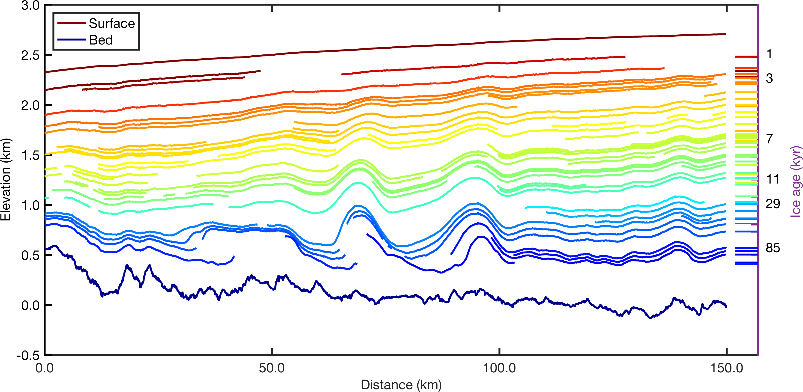
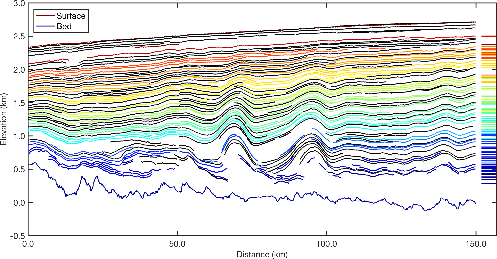

## Automated RES Englacial Layer-tracing Package (ARESELP)

This package is used for tracing englacial layers from Radio Echo Sounding (RES) data. It has been tested to be useful for picking subsurface layering features from Multi-Channel Coherent Radar Depth Sounder (MCoRDS) L1B Data which is publicly available in the National Snow and Ice Data Centre ([NDSIC](http://dx.doi.org/10.5067/WVDXEKH0X7N3)). 

Please cite the following reference. 
> Xiong, S., Muller, J.P. and Carretero, R.C., 2017. A New Method for Automatically Tracing Englacial Layers from MCoRDS Data in NW Greenland. Remote Sensing, 10(1), p.43. 

Please also cite the following reference if the test data are used.
> Leuschen, C.; Gogineni, P.; Hale, R.; Paden, J.; Rodriguez, F.; Panzer, B.; Gomez, D.IceBridge MCoRDS L1BGeolocated Radar Echo Strength Profiles, version 2; National Snow and Ice Data Center: Boulder, CO, USA, 2014. 

## Getting Started

### Prerequisites

Matlab R2014b is required to run codes in the package. 

### Installing

Firstly, download the 'ARESELP' and put it into a folder, such as /home. 

The main package needs to be imported before being used. 

```matlab
addpath('./home/ARESELP/layer-tracing/');
```
Tools which are used for plotting the intermediate and final layer-tracing results are provided as well. 

```matlab
addpath('./home/ARESELP/utils/');
```

### Test data
Test data can be found in the following folder.

```bash
cd test_data
ls .
Data_20110329_02_019.mat	
Data_20110329_02_020.mat
Data_20110329_02_021.mat
Data_20120507_03_011.mat
Data_20120507_03_012.mat
```

## Running the tests

### 1. Processing one frame

The following steps is assembled in the 'processframe.m'. 

#### Loading data and pre-processing

```matlab
infilename = '/home/ARESELP/test_data/Data_20110329_02_020.mat';

[geoinfo,echogram] = readdata(infilename);
% convert surface and bed time to row numbers 
% imDat, raw data as natural logarithm
% imAmp, which is converted from imDat to dB units
[imDat,imAmp, ysrf,ybtm] = preprocessing(geoinfo,echogram);
```

#### Peak detection
* **CWT-based peak detection**

	The test is testing the generation of the CS image by using CWT-based peak detection. 

```matlab
% define the wavelet scales
scales = 3:15;
% choose the wavelet 'mexh' or 'morl'
wavelet = 'mexh';
% decide how many pixels below bed layer 
% is counted as background noise
bgSkip = 50;
peakim = peakimcwt(imAmp,scales,wavelet,ysrf,ybtm,bgSkip);
```
* **APP-based peak detection**

	The test is testing the generation of the S/L ratio image by using APP-based peak detection. 

#### Selection of Seed points
 
```matlab
% peakim : the CS or S/L ratio image 
% which is used for tracing layers.
% seed point selection
seedpt = selectseedpt(peakim);
```

#### Layer-tracing and post-processing

The test is for tracing layers by using the CS image or S/L ratio image.  

```matlab
% define parameters: distance allowance, block size, slope angle difference
DIST = 7; BLOCKSIZE = 51; SMOOTHANGLE = 90;
params = {DIST,BLOCKSIZE,SMOOTHANGLE}; 

% imLayer: the image containing traced layers
% debuginfo: no. lengths, and remaining point output for debugging
tic; 
[imLayer,dinfo] = tracelayers(peakim,seedpt,params); 
toc;
tic; 
[newimLayer, labelLayer] = postprocesslayers(imLayer, DIST);
toc;
```
#### Save result of one frame

```matlab
outfilename = '/home/ARESELP/test_data/Data_20110329_02_020-layers.mat';
savegeolayers(outfilename,geoinfo,imAmp,newimLayer,labelLayer);
```
Plot the traced layers in the geographical coordinates.

```matlab
load(outfilename);
plotgeolayers(geolayers,'rand');
```

### 2. Connection of layers from multi-frame data

The test is for combining sets of layers from multi-frame of MCoRDS data. 

Make an input file list for frames on one segment
	
```bash
pwd
./home/
cat datalist1.txt
<< 3
Data_20110329_02_019.mat
Data_20110329_02_020.mat
Data_20110329_02_021.mat
>> Data_20110329_02_019-021-layers.mat
```
Run the batch connection of frames

```matlab
batchconnectframes('datalist1.txt');
```

### 3. Batch processing for multi-segment
The test is for combining sets of layers from multi-frame of MCoRDS data on multi-segment. 

Make an input file list for frames on one segment

```bash
pwd
./home/
cat datalist.txt
<< 3
Data_20110329_02_019.mat
Data_20110329_02_020.mat
Data_20110329_02_021.mat
>> Data_20110329_02_019-021-layers.mat
<< 2
Data_20120507_03_011.mat
Data_20120507_03_012.mat
>> Data_20120507_03_011-012-layers.mat
```

Run the batch connection of frames

```matlab
batchconnectframes('datalist.txt');
```

## Examples of Results


Figure 1. The RRRAG isochrones from MacGregor's study.


Figure 2. Comparison  of  the  traced  englacial  layers  from  radio  echogram  from  MCoRDS  data (frames 19-21 from segment of 20110329\_02)

## Version

We use [SemVer](http://semver.org/) for versioning. Current release version is 1.0.0.

## Authors

* **Si-Ting Xiong** - *Initial work* - [Layer-tracing](https://github.com/xiongsiting/)
* **Jan-Peter Muller**- *Initial work*
* **Raquel Caro Carretero** - *Initial work*

## License

This project is licensed under the MIT License - see the [LICENSE.md](LICENSE.md) file for details

## Acknowledgments

* We thank the China Scholarship Council (CSC) and University College London (UCL) Deanof MAPS prize who jointly sponsored this work. 
* The authors would like to thank the Ministerio de Economía yCompetitividad of Spain (project ESP2016-79135-R) for support for their sabbatical
* The authors would also like tothank the ESA-NRSCC DRAGON for their travel support to present preliminary results of this work. 
* We would like to thank the Center forRemote Sensing of Ice Sheets (CreSIS) for publishing the MCoRDS datasets and thank Joseph MacGregor et al. forpublishing their radiostratigraphic datasets via the National Snow and Ice Data Center (NSIDC). 
